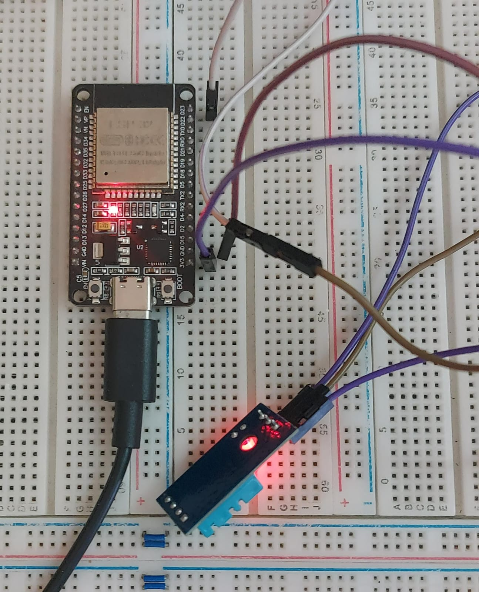
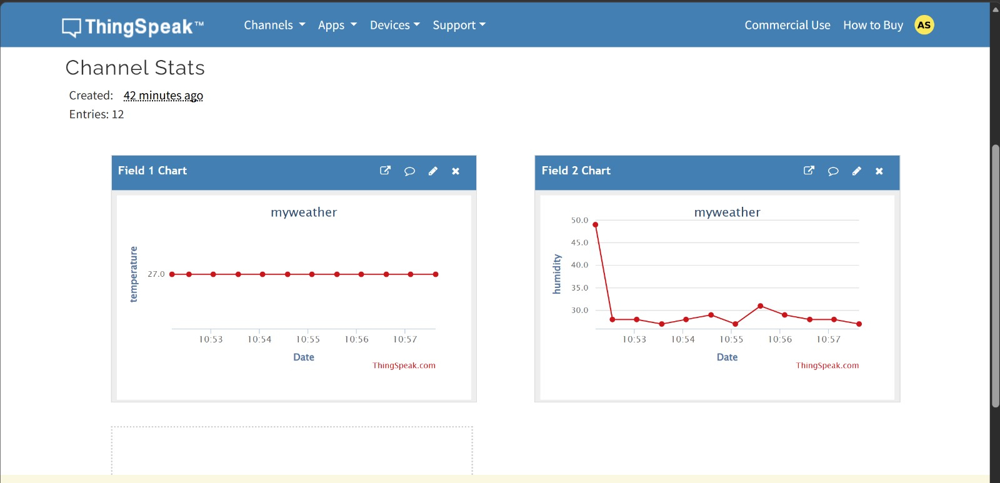

# ESP32 IoT Weather Monitoring System

## Project Overview
This project is an IoT-based weather monitoring system. It uses an **ESP32** microcontroller and a **DHT11** sensor to read real-time temperature and humidity, and then transmits the data to a **ThingSpeak** cloud dashboard over Wi-Fi. 

## Features
* Real-time temperature and humidity monitoring.
* Wireless data transmission using ESP32 Wi-Fi capabilities.
* Cloud data logging and data visualization (Charts) using ThingSpeak API.

## Hardware Requirements
* ESP32 Development Board
* DHT11 Temperature & Humidity Sensor
* Breadboard & Jumper Wires

## Project Gallery
### Hardware Setup
*(Ensure you name your uploaded hardware image correctly, e.g., hardware_setup.jpg)*


### ThingSpeak Live Dashboard
*(Ensure you name your uploaded dashboard image correctly, e.g., dashboard.jpg)*


## Code Setup & Usage
1. Open the `.ino` file in the Arduino IDE.
2. Install the `DHT sensor library` by Adafruit.
3. Update the Wi-Fi credentials in the code:
   ```cpp
   const char* ssid = "YOUR_WIFI_SSID";
   const char* password = "YOUR_WIFI_PASSWORD";
